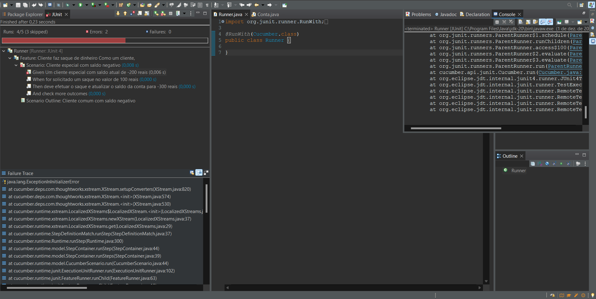

# BDD - Conta Bancária
## Avaliação Final de Qualidade e Testes de Software

## Documentação

## Escrevendo o código da classe conta
Classe [`Conta`](src/main/java/Conta.java/)

## Executando o projeto
Informações dadas no console.

## Gerando o JavaDoc do projeto e a documentação da classe conta
Documentação da classe [`Conta`](src/main/java/Conta.java/), JavaDoc está no caminho [`doc/`](doc/)

# Última atualização - 29/11/2023
