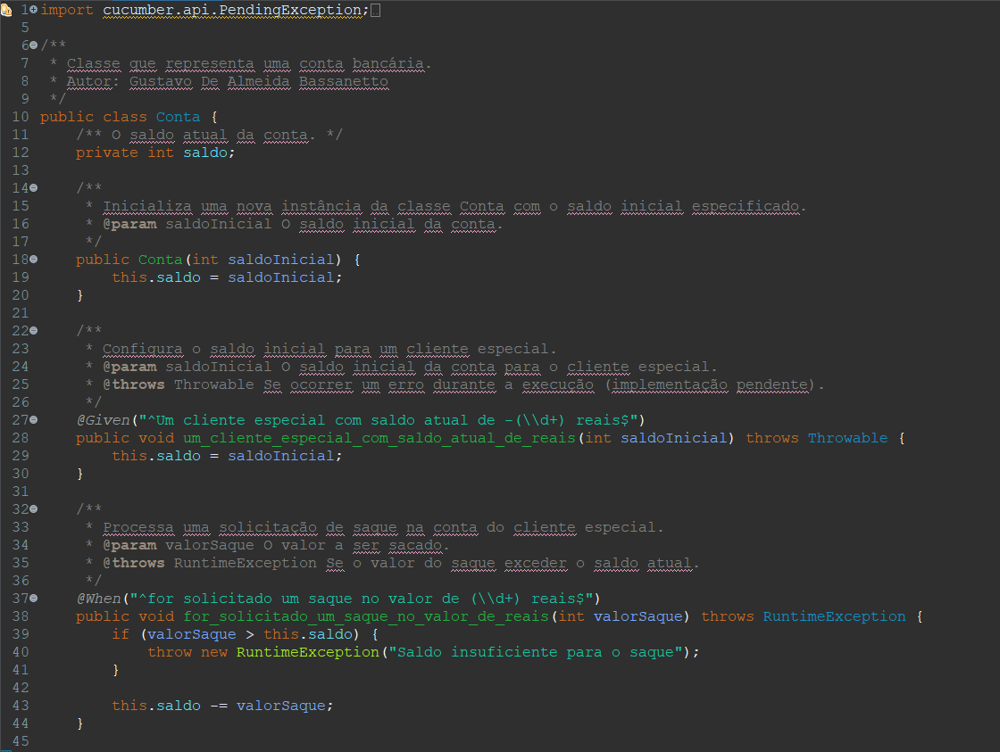
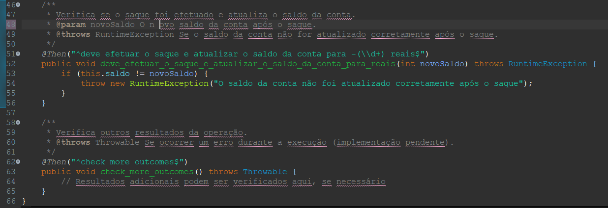
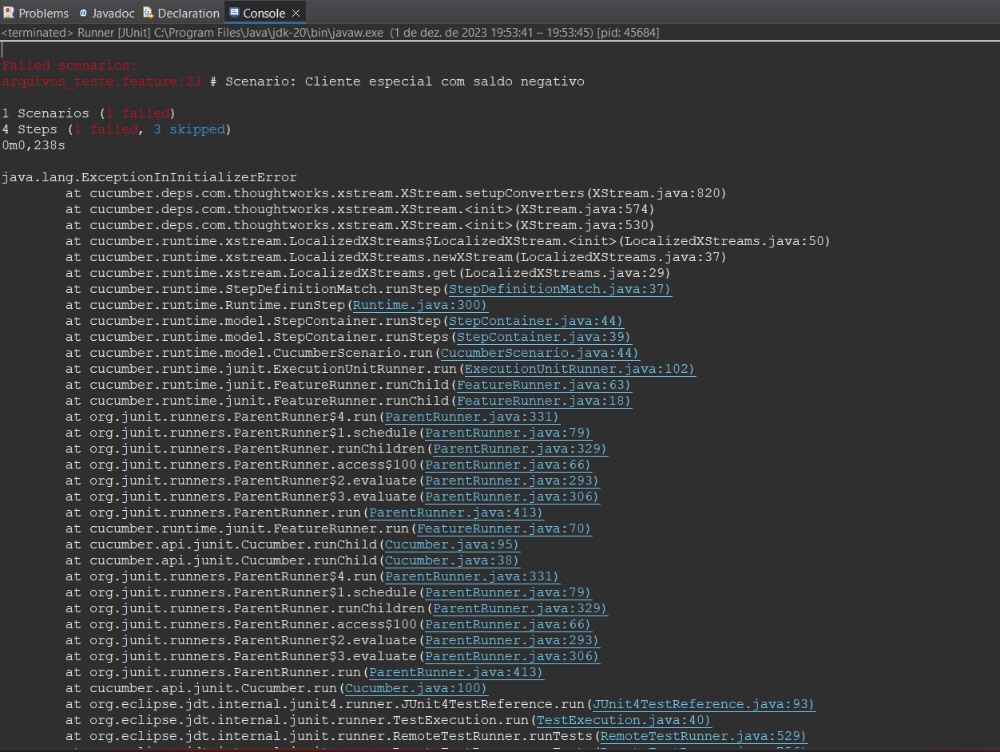

# BDD - Conta Bancária
## Avaliação Final de Qualidade e Testes de Software

## Documentação
###  A seguir irei demonstrar a documentação e o funcionamento da Conta Bancária 
> a classe **Runner** serve como ponto de entrada para a execução de **testes Cucumber usando o JUnit**. A anotação @RunWith configura o JUnit para usar a classe Cucumber como o mecanismo de execução, permitindo que os cenários de teste Cucumber sejam executados como parte dos testes JUnit.
 

## Escrevendo o código da classe conta
Classe [`Conta`](src/main/java/Conta.java)
> A classe Conta é uma representação de uma conta bancária em Java, projetada para suportar testes de aceitação usando a biblioteca Cucumber. O principal objetivo desta classe é simular transações bancárias, como saques, e verificar se o saldo é atualizado corretamente.

> A utilização das anotações Cucumber (@Given, @When, @Then) permite que esses métodos sejam associados aos passos correspondentes em cenários de teste escritos em Gherkin. Assim, a classe Conta pode ser facilmente integrada em um fluxo de teste de aceitação automatizado usando Cucumber, proporcionando uma abordagem eficaz para validar o comportamento desejado das transações bancárias.
 

## Executando o projeto
### Essas são as informações que são exibidas ao rodar o projeto e os casos de teste forem análisados

# Última atualização - 01/12/2023
